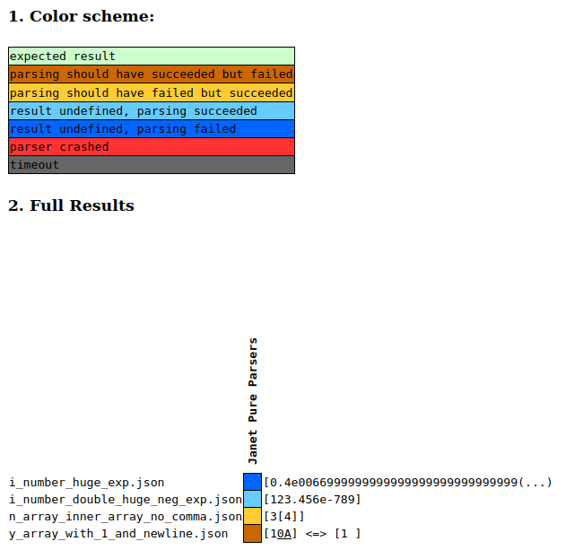

# JSON Parser tests

These rely on [JSON Parsing Test Suite](https://github.com/nst/JSONTestSuite), which is written in Python3.

How to test:
1. run `./prepare-test-suite.sh`, it checks out the repo and patches in the support for running the tests again janet-pp.
1. run `./json-test-suite/run_tests.py --filter=filter-only-janet.json`.
1. examine the output in `./json-test-suite/results/parsing_pruned.html`.

At the time of this writing it looks like this:

It assumes that you have the `janet` executable is in your path.
